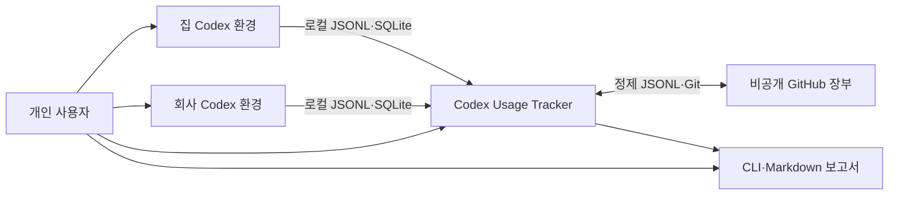
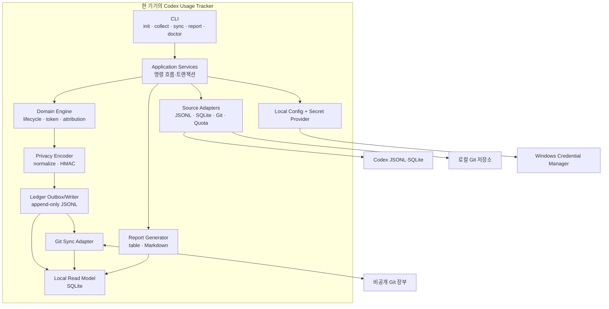
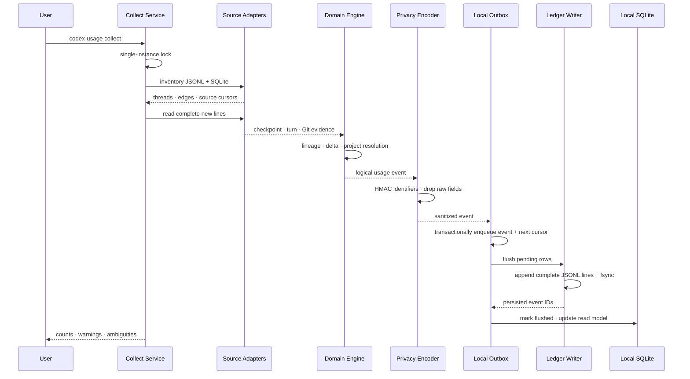
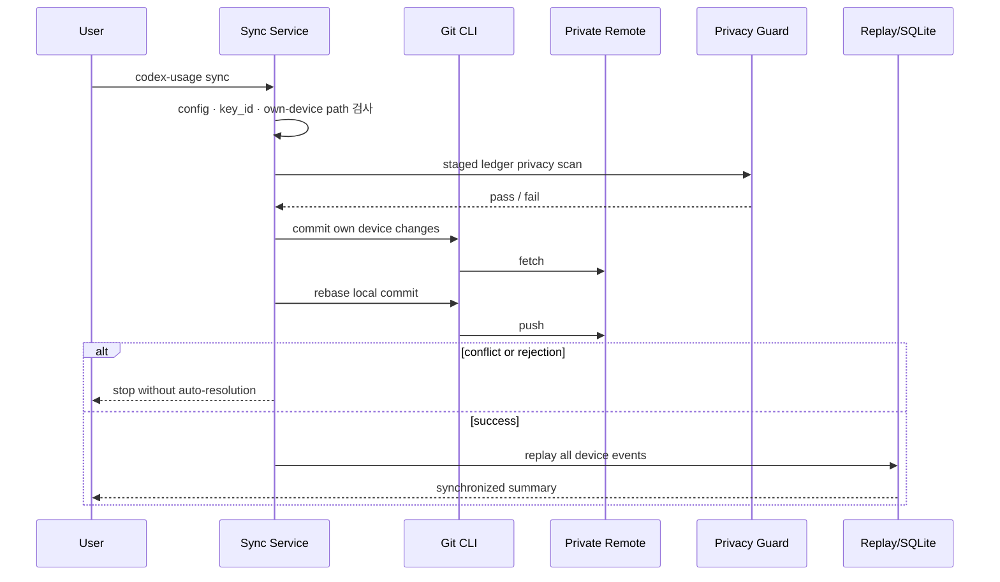
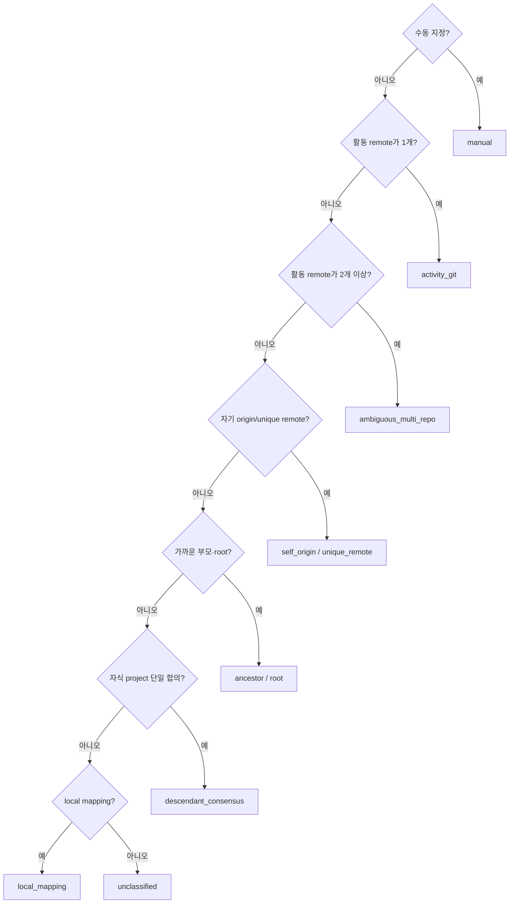
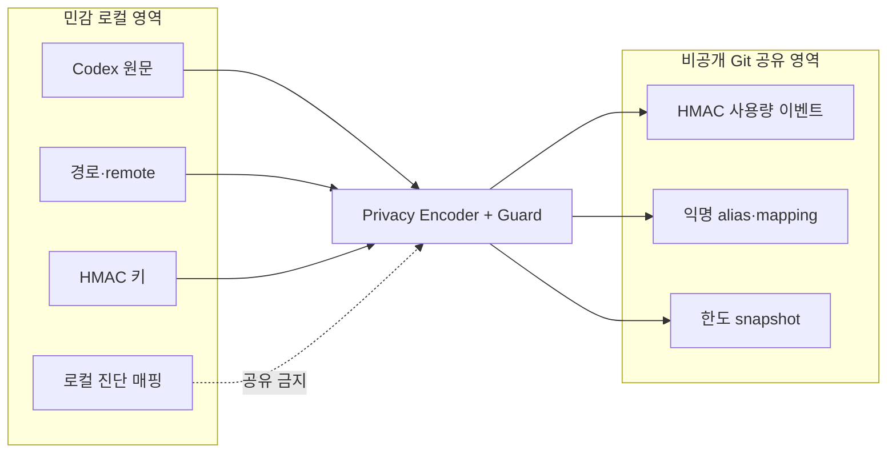

# Codex Usage Tracker v1 아키텍처

상태: 승인됨

작성일: 2026-08-26

## 설계 목표

- Codex 원본을 수정하지 않는 local-first 도구
- 여러 기기와 fork·오케스트레이션에서도 결정적인 집계
- Git 장부에 민감한 원문이 들어가지 않는 구조
- 중단·재실행·중복 수집에도 결과가 변하지 않는 처리
- 중앙 장부만으로 로컬 조회 DB를 재생성하는 복구성

## 설계 원칙

1. 원천 JSONL·SQLite는 read-only다.
2. 원문을 중앙 장부에 쓰기 전에 로컬에서 분류하고 HMAC 처리한다.
3. 모호한 프로젝트 귀속은 추측하지 않는다.
4. 장부는 append-only이고 조회 DB는 폐기 가능한 파생물이다.
5. 내부 Codex 포맷 변화는 버전별 source adapter에서 격리한다.
6. v1은 서버 없는 단일 프로세스 CLI로 구현한다.

## C4 Level 1: 시스템 컨텍스트



Codex Usage Tracker는 별도 중앙 서버를 운영하지 않는다. 각 기기의 로컬 프로세스가 같은 비공개 Git 장부를 통해 정제 이벤트만 교환한다.

## C4 Level 2: 컨테이너



## C4 Level 3: 핵심 컴포넌트

| 컴포넌트 | 책임 | 입력 | 출력 |
|---|---|---|---|
| Source Inventory | thread·rollout·spawn-edge 목록 작성 | JSONL 경로, SQLite | source catalog |
| Versioned JSONL Parser | 버전별 레코드 해석과 turn state 구성 | JSONL line | raw checkpoint |
| Lineage Resolver | parent·root·fork 관계 계산 | session meta, spawn-edge | lineage graph |
| Git Resolver | workdir·origin·unique remote 판별 | cwd, local Git | normalized remote 후보 |
| Project Attributor | turn별 우선순위와 ambiguity 결정 | activity Git, lineage, mappings | project resolution |
| Lifecycle Calculator | 신규·resume·fork·compact delta 계산 | checkpoint stream | logical usage event |
| Privacy Encoder | raw 식별자의 HMAC 변환 | logical event, secret | sanitized event |
| Local Outbox | crash-safe pending event 보존 | sanitized event | pending ledger row |
| Ledger Writer | 기기별 JSONL append와 flush | pending rows | ledger files |
| Replay Engine | revision·alias·manual mapping 적용 | 모든 ledger rows | effective events |
| Read Model | 조회용 정규화·집계 | effective events | SQLite tables/views |
| Git Sync Adapter | commit·fetch·rebase·push | ledger worktree | synchronized ledger |
| Reporter | 필터·그룹·누적 계산 | read model | terminal·Markdown |
| Doctor | 환경·버전·privacy·sync 검사 | config, stores | diagnostics |

## 수집 데이터 흐름



### crash-safe 규칙

- source cursor와 outbox event를 같은 로컬 SQLite transaction에 기록한다.
- 장부 append 전 종료되면 outbox가 다음 실행에서 다시 flush한다.
- 장부 append 후 상태 갱신 전 종료되면 `event_id` 검색으로 중복 append를 막는다.
- JSONL 마지막 partial line은 읽지 않고 다음 실행까지 기다린다.
- 한 기기에서는 collect와 sync를 동시에 실행하지 않도록 lock을 사용한다.

## sync 데이터 흐름



### Git 동기화 규칙

- 장부는 전용 저장소로 사용한다.
- 한 device는 `devices/<device-id>/` 아래만 수정한다.
- sync가 알 수 없는 파일 수정이나 다른 device 경로 수정을 발견하면 중단한다.
- 자동 force push와 자동 conflict resolution은 하지 않는다.
- push 실패 시 로컬 commit과 outbox를 보존한다.

## report 데이터 흐름

```text
ledger JSONL
→ schema validation
→ latest revision 선택
→ voided 제외
→ project alias 해소
→ manual assignment 적용
→ SQLite read model
→ filter · group · cumulative
→ terminal table 또는 Markdown
```

보고서는 원천 checkpoint를 다시 계산하지 않고 effective usage event의 delta를 합산한다. parser version이 바뀌어 정정 이벤트가 추가되면 replay만으로 결과가 갱신된다.

## 프로젝트 귀속 처리

Project Attributor는 thread 전체가 아니라 turn별 evidence를 입력받는다.



## 로컬 SQLite 경계

로컬 SQLite는 두 역할을 가진다.

### operational state

- source cursor와 file fingerprint
- outbox와 flush 상태
- collect·sync 실행 이력
- 로컬 raw ID ↔ HMAC key 진단 매핑
- parser issue

### rebuildable read model

- latest usage revision
- effective project alias
- thread lineage
- 날짜·프로젝트·모델·기기 조회 인덱스
- quota snapshot

operational state는 장부에서 완전히 복구되지 않을 수 있지만, 사용량과 보고서는 장부만으로 복구돼야 한다.

## 보안·개인정보 경계



- HMAC 키는 Windows Credential Manager의 secret provider에 저장한다.
- 비밀키의 비가역 key ID만 이벤트에 기록해 기기 설정 불일치를 탐지한다.
- Git 인증은 Git Credential Manager에 맡기고 애플리케이션이 token을 저장하지 않는다.
- privacy guard는 raw URL, Windows·POSIX 절대경로, prompt 계열 필드를 commit 전에 차단한다.
- 사용자 승인 표시명은 예외적으로 mapping event에 저장할 수 있다.

## 실패 처리

| 상황 | 동작 |
|---|---|
| 지원하지 않는 `cli_version` | 알려진 공통 필드만 읽고 경고, 불확실한 delta는 quarantine |
| SQLite 잠김·일시 오류 | 제한 재시도 후 JSONL-only 수집, lineage 미완성 경고 |
| JSONL partial line | 무시하고 cursor를 전진하지 않음 |
| 누적 토큰 감소 | delta null, `counter_regression`, 합계 제외 |
| Git cwd 삭제 | session meta 또는 기존 local mapping 사용, 없으면 unclassified |
| 여러 remote·여러 프로젝트 | ambiguous로 보존, 자동 선택 금지 |
| HMAC key ID 불일치 | sync·replay 중단 |
| schema validation 실패 | 해당 line quarantine, 나머지 replay 지속 |
| alias cycle | 관련 alias 무효화, 원래 project ID 유지 |
| Git rebase conflict | 자동 해결하지 않고 로컬 상태 보존 후 종료 |
| privacy scan 실패 | commit·push 차단 |

## 기술 구조

v1은 Python 3.12+ 기반 modular monolith CLI로 설계한다.

```text
src/codex_usage/
├─ cli/                 명령·출력
├─ application/         collect·sync·report use case
├─ domain/              token·lineage·project·event 규칙
├─ sources/             JSONL·SQLite·Git·quota adapter
├─ privacy/             normalize·HMAC·guard
├─ ledger/              outbox·JSONL writer·replay
├─ storage/             local SQLite
├─ sync/                Git CLI adapter
└─ reports/             query·table·Markdown

schemas/                ledger JSON Schema
tests/
├─ fixtures/            합성 lifecycle·Git 구조
├─ unit/
├─ integration/
└─ acceptance/
```

도메인 계층은 파일시스템·SQLite·Git CLI를 직접 호출하지 않는다. application 계층이 port를 통해 adapter를 조합한다.

## 배포 구조

- v1 개발·검증: Python package와 console script
- Windows 우선 실행
- 독립 실행 파일 패키징은 core 정확성 검증 이후
- 별도 웹 서버·데몬·외부 데이터베이스 없음
- GitHub에는 공개 소스 저장소와 사용자별 비공개 데이터 장부를 분리

## 품질 전략

- 순수 domain 함수는 fixture 기반 unit test
- JSONL·SQLite adapter는 버전별 integration fixture
- lifecycle·Git 구조는 Spike 1~4 fixture를 acceptance test로 고정
- 같은 장부를 다른 순서로 세 번 replay해 동일 결과 확인
- privacy leak fixture가 commit guard에서 차단되는지 확인
- Windows 경로·Unicode·partial line·파일 이동을 별도 테스트

## 구현 순서 후보

1. domain event·HMAC·remote normalization
2. JSONL token parser와 lifecycle delta
3. SQLite lineage adapter와 project attribution
4. local SQLite outbox·read model
5. ledger writer·replay·JSON Schema validation
6. CLI collect·doctor
7. report table·Markdown
8. Git sync
9. quota 보조 수집

실제 Build 단계 착수와 순서는 설계 승인 후 확정한다.

## ADR 목록

- [ADR-001: Python modular monolith CLI](docs/adr/0001-python-modular-monolith.md)
- [ADR-002: JSONL과 SQLite 이중 원천](docs/adr/0002-dual-codex-sources.md)
- [ADR-003: 기기별 append-only Git 장부](docs/adr/0003-append-only-git-ledger.md)
- [ADR-004: HMAC 비식별화와 로컬 secret](docs/adr/0004-hmac-identifiers.md)
- [ADR-005: turn 단위 프로젝트 귀속과 lifecycle 중복 제거](docs/adr/0005-turn-attribution-and-dedup.md)
- [ADR-006: 재생성 가능한 SQLite read model](docs/adr/0006-rebuildable-read-model.md)
