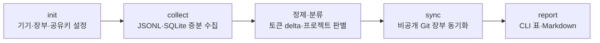

# Codex Usage Tracker v1 PRD

상태: Plan 단계 초안

대상 버전: v1

작성일: 2026-08-26

## 제품 정의

여러 기기와 여러 Codex 작업에 흩어진 실제 토큰 사용량을 로컬 로그에서 수집하고, 같은 Git 프로젝트와 오케스트레이션 계보 기준으로 통합해 CLI와 Markdown으로 조회하는 개인용 도구다.

중심 기능은 구독 한도 표시가 아니라 **프로젝트별 실제 토큰 사용량 추적**이다.

## 용어

| 용어 | 정의 |
|---|---|
| 프로젝트 | 기본적으로 하나의 normalized Git remote로 식별되는 사용량 집계 단위 |
| thread·작업 | Codex의 독립 대화·실행 단위. UI에서는 작업으로 표시할 수 있다. |
| turn | 하나의 thread 안에서 시작되고 완료되는 사용자 요청·에이전트 처리 구간 |
| checkpoint | Codex가 기록한 thread 누적 토큰 상태 |
| delta | 현재 checkpoint와 이전 checkpoint의 차이로 계산한 실제 증가량 |
| usage event | 비식별화된 checkpoint와 delta를 담는 중앙 장부의 최소 레코드 |
| 계보 | root·부모·자식 에이전트가 연결된 오케스트레이션 관계 |
| device | 하나의 로컬 Codex 환경. 영구 UUID로 구분한다. |
| 장부 | 여러 기기가 공유하는 비공개 Git의 append-only JSONL 데이터 |
| ambiguous | 후보가 여러 개라 자동 귀속할 수 없는 상태 |
| unclassified | 프로젝트 판별 근거가 없는 상태 |
| quota | Codex가 직접 보고한 계정 한도 사용률과 reset 정보 |

## 사용자와 사용 환경

- 집·회사·노트북 등 임의 개수의 Windows 기기에서 Codex를 사용하는 개인
- 같은 Git 저장소를 서로 다른 로컬 폴더명으로 사용하는 환경
- 한 프로젝트에서 여러 Codex 작업과 자식 에이전트를 동시에 사용하는 환경
- CLI·백그라운드·Codex 앱 작업을 함께 사용하는 환경

회사 기기 데이터는 회사 정책이 허용할 때만 정제 통계를 개인 비공개 장부에 저장한다.

## 해결할 문제

현재 Codex 사용량은 기기·thread·자식 에이전트별로 분산된다. 누적 토큰값을 그대로 더하면 resume·fork·compact 때문에 중복될 수 있고, 프로젝트 밖 오케스트레이터는 session Git 정보만으로 실제 프로젝트를 식별할 수 없다.

v1은 다음 질문에 답해야 한다.

> 특정 기간에 어떤 Git 프로젝트에서 어떤 모델과 기기로 실제 토큰을 얼마나 사용했는가?

## 목표

- Codex JSONL과 SQLite에서 실제 토큰 체크포인트를 증분 수집한다.
- resume·fork·compact와 재수집으로 인한 중복을 제거한다.
- turn별 실제 활동 위치와 오케스트레이션 계보를 이용해 프로젝트를 판별한다.
- 임의 개수 기기의 정제 이벤트를 비공개 GitHub 장부로 통합한다.
- 프로젝트·날짜·thread·모델·reasoning effort·기기별 사용량을 조회한다.
- 중앙 장부만으로 로컬 조회 DB와 보고서를 다시 생성한다.

## 비목표

- 대화·응답·코드·명령 출력 백업
- 팀원 감시와 조직 관리
- API 비용 청구
- 토큰만으로 구독 한도 소모율 역산
- v1에서 웹 대시보드나 Codex 여백 UI 제공
- 모든 과거·미래 Codex 내부 포맷의 무조건적 지원
- 한 turn의 토큰을 여러 Git 저장소에 임의 분할

## 핵심 사용자 흐름



### 최초 설정

1. 사용자가 비공개 Git 장부 저장소를 준비한다.
2. 첫 기기에서 device UUID와 공유 HMAC 키를 만든다.
3. 추가 기기에는 같은 HMAC 키와 장부 주소를 설정한다.
4. HMAC 키와 인증정보는 Git에 저장하지 않는다.

### 일상 사용

```text
codex-usage collect
codex-usage sync
codex-usage report --from 2026-08-01 --group-by project,model
```

### 수동 프로젝트 연결

자동 판별할 수 없는 remote-less 또는 ambiguous 작업은 사용자가 기존 project ID에 연결한다.

```text
codex-usage project list
codex-usage project link --thread <local-thread-id> --project <project-id>
```

원본 thread ID는 로컬 명령 입력에만 사용하고 중앙 장부에는 HMAC key만 저장한다.

## 기능 요구사항

### FR-001. 기기 초기화

- 각 기기에 영구 device UUID를 한 번 생성한다.
- 비공개 장부 경로와 기본 표시 시간대를 설정한다.
- 기존 공유 HMAC 키 입력 또는 새 키 생성을 지원한다.
- 비가역 key ID를 계산해 장부의 기존 key ID와 일치하는지 확인한다.
- 키·Git 인증정보는 장부에 커밋하지 않는다.

### FR-002. 원천 데이터 탐색

- 활성·보관 JSONL rollout을 모두 탐색한다.
- SQLite thread 인덱스와 spawn-edge를 읽는다.
- 원천 파일을 수정하거나 SQLite에 쓰지 않는다.
- `cli_version`별 파서 어댑터와 unknown 레코드 무시 기능을 둔다.

### FR-003. 증분 수집

- rollout별 마지막 안전 커서를 로컬 상태 DB에 저장한다.
- 진행 중인 append 파일을 다시 읽어도 기존 이벤트를 중복 생성하지 않는다.
- 파일 이동·archive 여부가 달라도 thread 식별자로 같은 원천을 인식한다.
- 원천 파일이 잘렸거나 재작성되면 경고 후 안전하게 재검사한다.

### FR-004. 토큰 계산

- 누적 체크포인트와 계산된 delta를 함께 저장한다.
- 동일 누적 체크포인트의 delta는 0이다.
- 신규 일반 thread의 첫 체크포인트는 첫 사용량으로 처리한다.
- resume는 같은 누적 카운터를 이어서 계산한다.
- fork가 복사한 turn은 전역 멱등 키로 중복 제거한다.
- compact의 불투명한 reported last는 별도 보존하고 일반 합계에서는 제외한다.
- 캐시·추론 토큰을 total에 다시 더하지 않는다.

### FR-005. thread·turn 계보

- SQLite spawn-edge로 직접 부모를 연결한다.
- JSONL session ID로 계보 root를 보존한다.
- fork 관계는 `forked_from_id`를 사용한다.
- edge가 없는 자식도 root 관계를 잃지 않고 보존한다.

### FR-006. 프로젝트 판별

각 usage event가 속한 turn마다 다음 우선순위를 적용한다.

```text
수동 지정
→ turn의 활동 workdir에서 확인한 단일 Git remote
→ thread 자체 origin remote
→ cwd의 유일한 non-origin remote
→ 가장 가까운 부모·root 프로젝트
→ 자식 저장소 단일 합의
→ local mapping
→ ambiguous 또는 unclassified
```

- worktree는 같은 remote 프로젝트로 합친다.
- submodule은 자기 remote 프로젝트를 우선한다.
- monorepo는 기본적으로 저장소 하나이며 수동 매핑으로만 분리한다.
- 한 turn에서 remote가 둘 이상이면 `ambiguous_multi_repo`로 둔다.
- remote가 바뀌면 project alias 이벤트로 과거와 연결한다.

### FR-007. 비식별화

- normalized remote로부터 공유 HMAC 키를 사용해 project ID를 만든다.
- thread·turn·root·parent·fork 식별자도 HMAC key로 저장한다.
- 이벤트에는 비밀을 노출하지 않는 key ID를 저장해 기기별 키 불일치를 탐지한다.
- 중앙 장부에 프롬프트·응답·코드·명령·출력·로컬 경로·raw remote·branch를 저장하지 않는다.
- 프로젝트·기기 표시명은 사용자가 명시적으로 정한 값만 mapping event로 저장한다.
- 로컬 조회 DB에는 디버깅에 필요한 최소 매핑만 보관한다.

### FR-008. append-only 장부

- 기기 하나는 자기 device 디렉터리에만 쓴다.
- usage·mapping·quota 이벤트를 JSONL로 append한다.
- parser 정정은 revision과 `supersedes` 이벤트로 표현한다.
- v1에서는 장부 이벤트를 삭제하거나 롤업하지 않는다.

### FR-009. Git 동기화

- 수집 전 최신 장부를 가져오고, 수집 후 자기 기기 파일만 커밋·푸시한다.
- 다른 기기 파일과 충돌 없이 병합할 수 있어야 한다.
- push 실패 시 로컬 이벤트를 잃지 않고 다음 sync에서 재시도한다.
- 데이터 장부 저장소와 공개 소스코드 저장소는 분리한다.

### FR-010. 로컬 조회 DB 재생성

- 중앙 장부의 JSONL만으로 로컬 SQLite 조회 DB를 재생성한다.
- 동일 logical event는 가장 최신의 유효 revision만 적용한다.
- project alias와 manual assignment를 적용한 최종 project ID를 계산한다.

### FR-011. CLI 조회

최소 명령:

```text
codex-usage init
codex-usage collect
codex-usage sync
codex-usage report
codex-usage project list
codex-usage project link
codex-usage doctor
```

`report` 필터와 그룹:

- 기간: 날짜 범위, 오늘, 이번 주, 전체
- 필터: project, model, device, source
- 그룹: project, date, thread, model, reasoning effort, device
- 출력: terminal table, Markdown file
- 지표: 기간 합계, 날짜별 사용량, 누적 사용량, 토큰 세부 항목

### FR-012. 진단

`doctor`는 다음을 확인한다.

- Codex 데이터 경로와 읽기 권한
- 지원·미지원 CLI 버전
- JSONL·SQLite 조인 누락
- Git 장부 상태와 인증
- HMAC 키 존재 여부
- 모든 device 이벤트의 HMAC key ID 일치 여부
- unclassified·ambiguous 이벤트 수
- 파서 경고와 마지막 성공 수집 시각

### FR-013. 한도 보조 정보

- Codex가 직접 제공한 사용률·reset 시각만 quota snapshot으로 저장한다.
- 토큰 합계에서 한도 소모율을 계산하지 않는다.
- quota 수집 실패는 core usage 수집을 실패시키지 않는다.

## 비기능 요구사항

- Windows를 v1 우선 지원 환경으로 한다.
- 원천 Codex 파일은 항상 read-only로 취급한다.
- 같은 입력 장부에서 같은 보고서가 재현돼야 한다.
- 중간 실패 후 재실행해도 합계가 변하지 않아야 한다.
- unknown 필드와 레코드가 있어도 전체 수집을 중단하지 않는다.
- 오류는 원천 파일과 위치를 로컬 진단 로그에 남기되 민감정보는 Git에 올리지 않는다.
- 백만 usage event 규모에서도 전체 재생성과 일반 조회가 개인용으로 실용적인 시간 안에 끝나야 한다.

## v1 수용 조건

- 두 개 이상의 device 장부를 하나의 로컬 DB로 통합한다.
- 서로 다른 폴더의 같은 normalized remote를 같은 project ID로 집계한다.
- 부모·자식·CLI·백그라운드 사용량을 포함한다.
- resume·fork·compact 테스트 fixture의 예상 delta와 일치한다.
- 같은 로그를 세 번 수집해도 총합이 변하지 않는다.
- worktree·submodule·monorepo·remote-less fixture가 확정 규칙대로 분류된다.
- remote 변경 전후 프로젝트가 alias로 하나의 보고서에 표시된다.
- project·date·thread·model·device 기준 CLI 조회와 Markdown 출력이 동작한다.
- 장부를 새 폴더에 clone한 뒤 로컬 DB를 완전히 재생성한다.
- Git 장부 검사에서 금지된 원문 데이터가 발견되지 않는다.
- unclassified와 ambiguous 이벤트를 사용자가 확인하고 수동 연결할 수 있다.

## v1 이후

- 주기 실행과 Codex 종료 연동 자동 수집
- 로컬 웹 또는 데스크톱 대시보드
- Codex 채팅 여백의 현재 프로젝트 사용량 UI
- monorepo 하위 프로젝트 규칙
- compact overhead와 구독 한도의 상관 분석

## 관련 문서

- [프로젝트 브리프](PROJECT.md)
- [데이터 스키마](SCHEMA.md)
- [JSON Schema](schemas/ledger-event-v1.schema.json)
- [v1 아키텍처](ARCHITECTURE.md)
- [결정 기록](DECISIONS.md)
- [조사 기록](RESEARCH.md)
- [미확인 사항](OPEN_QUESTIONS.md)
