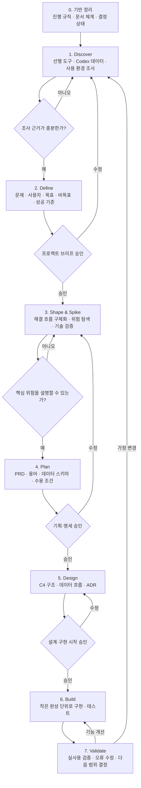
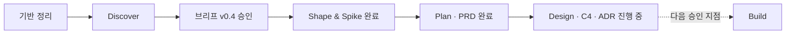

# 프로젝트 진행 방법론

상태: 사용 중

이 문서는 코덱스 사용량 추적 프로젝트를 아이디어 탐색부터 구현까지 어떤 순서로 진행할지 정의한다.

## 기본 방법

하나의 방법론을 그대로 사용하지 않고 다음 방식을 조합한다.

- [Double Diamond](https://www.designcouncil.org.uk/resources/framework-for-innovation/): 문제를 넓게 조사하고 핵심 문제를 좁혀 확정한다.
- [Shape Up](https://basecamp.com/shapeup/1.5-chapter-06): 문제, 해결 방향, 위험, 제외 범위를 정리한다.
- [PRD](https://www.atlassian.com/agile/product-management/requirements/): 목표, 요구사항, 성공 기준을 명세한다.
- [Technical Spike](https://www.agilealliance.org/wp-content/uploads/2017/08/AgileExtension_V2-Member-Copy.pdf): 불확실한 기술만 짧게 실험해 검증한다.
- [C4 Model](https://c4model.com/): 시스템 구조와 데이터 흐름을 설계한다.
- [ADR](https://martinfowler.com/bliki/ArchitectureDecisionRecord.html): 중요한 기술 결정과 이유를 기록한다.

## 전체 진행 도식도

## 단계별 결과물

| 단계 | 확인할 내용 | 결과물 |
|---|---|---|
| 기반 정리 | 진행 규칙과 승인 지점 | `PROCESS.md` |
| Discover | 사실, 선행 사례, 데이터 구조, 미확인 사항 | `RESEARCH.md`, `OPEN_QUESTIONS.md` |
| Define | 문제, 사용자, 목표, 범위, 완료 기준 | `PROJECT.md` |
| Shape & Spike | 해결 흐름, 위험, 실험 결과 | 연구 기록과 결정 제안 |
| Plan | 기능·데이터 요구사항과 검증 조건 | PRD, `SCHEMA.md` |
| Design | 시스템 구조와 주요 기술 선택 | C4 도식, ADR |
| Build | 실행 가능한 기능과 테스트 | 코드와 테스트 |
| Validate | 실사용 결과와 다음 개선점 | 검증 기록, 다음 계획 |

## 진행 규칙

- 조사 내용은 `사실`, `가정`, `미확인`으로 구분한다.
- 결정은 `제안`, `확정`, `보류`, `폐기`, `대체됨`으로 관리한다.
- 브리프가 승인되기 전에는 구현 설계를 확정하지 않는다.
- 명세와 설계가 승인되기 전에는 제품 코드를 만들지 않는다.
- 기술적으로 불명확한 사항은 추측으로 확정하지 않고 Spike로 검증한다.
- 단계가 바뀔 때는 사용자 승인을 받는다.
- 새로운 피드백은 바로 적용하지 않고 기존 합의와 비교한 뒤 반영한다.

## 현재 위치

현재 구현은 시작하지 않았다. PRD와 스키마 v1 명세를 바탕으로 C4 구조, 데이터 흐름, 보안 경계, ADR을 작성하는 Design 단계다. 다음은 설계 검토와 사용자 승인 후 Build 단계로 이동한다.
