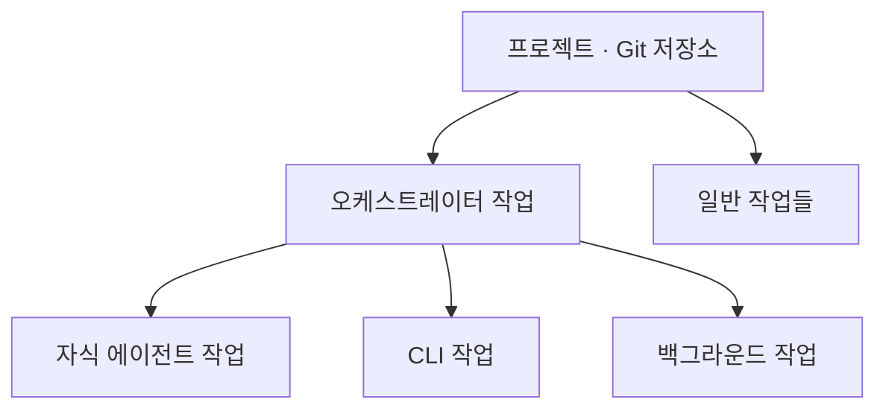
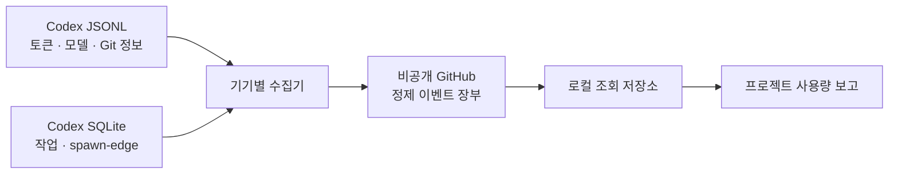

# 코덱스 사용량 추적 프로젝트

버전: 브리프 v0.4  
상태: 승인됨 · Spike 결과 반영 중

## 문제

여러 기기와 여러 Codex 작업을 사용하면 실제 토큰 사용량이 프로젝트별로 흩어진다. 특히 멀티에이전트 오케스트레이션에서는 사용량이 부모, 자식, CLI, 백그라운드 작업으로 나뉘기 때문에 부모 작업만 봐서는 프로젝트 전체 사용량을 알 수 없다.

## 사용자

집, 회사, 노트북 등 여러 환경에서 Codex와 멀티에이전트 오케스트레이션을 사용하는 개인 사용자.

## 목표

Codex 로컬 기록을 수집해 같은 Git 저장소와 오케스트레이션 계보에 속한 사용량을 하나의 프로젝트로 통합하고, 날짜·작업·모델·기기별 실제 토큰 사용량을 문서화한다.

## 핵심 구조

- 프로젝트 하나에 연결되는 작업 수는 제한하지 않는다.
- 프로젝트 폴더에서 실행한 작업은 Git 정보로 판별한다.
- 다른 폴더에서 실제 프로젝트를 다룬 작업은 turn의 도구 실행 위치, 명시적 매핑, 부모·자식 계보를 함께 사용해 연결한다.
- 자동 판별할 수 없는 작업은 미분류로 보존한 뒤 수동으로 연결한다.

## 데이터 흐름

## 핵심 기능

- 입력·출력·캐시 읽기·캐시 쓰기·추론 토큰 수집
- 누적 토큰 체크포인트 보존과 증가량 계산
- 프로젝트·날짜·작업·모델·reasoning effort·기기별 집계
- 부모·자식 작업을 포함한 프로젝트 전체 사용량 계산
- 여러 기기의 기록을 GitHub 비공개 장부로 통합
- 같은 데이터를 재수집해도 합계가 변하지 않는 멱등 처리
- 중앙 장부에서 로컬 조회 데이터를 다시 생성

## 기록 원칙

- Codex 원본 JSONL과 SQLite는 각 기기에만 둔다.
- GitHub에는 대화와 코드가 제거된 정제 사용 이벤트만 저장한다.
- 정제 이벤트에는 누적 체크포인트와 계산된 증가량을 함께 보존한다.
- 날짜별·주간·누적 사용량은 이벤트 장부에서 계산하는 파생 결과다.
- 구독 한도는 토큰으로 역산하지 않고 Codex가 보고한 값만 별도 기록한다.

## 비목표

- 대화와 코드 원문 백업
- 팀원 감시나 조직 관리
- API 비용 청구 시스템
- 토큰만으로 구독 한도 소모율 추정
- 처음부터 완성형 웹 대시보드 제작
- 모든 Codex 내부 버전에 대한 무제한 호환성 보장

## v1 완료 기준

- 두 개 이상의 기기 기록을 통합할 수 있다.
- 폴더명이 달라도 같은 Git 저장소를 하나의 프로젝트로 묶는다.
- 부모·자식·CLI·백그라운드 작업을 프로젝트 사용량에 포함한다.
- 누적 토큰 체크포인트를 중복 없이 증가량으로 변환한다.
- 같은 데이터를 여러 번 수집해도 총합이 변하지 않는다.
- 프로젝트·날짜·작업·모델·기기별 사용량을 조회할 수 있다.
- 중앙 장부만으로 로컬 통계를 다시 만들 수 있다.
- 대화·코드·민감한 경로가 GitHub에 저장되지 않는다.
- 테스트 로그의 예상 토큰과 계산 결과가 일치한다.
- fork·resume·compact가 포함된 작업을 이중 계산하지 않는다.
- 저장소 주소가 변경돼도 별칭으로 과거 기록을 이어 볼 수 있다.

## 부가 기능과 보류 기능

- 부가: Codex가 보고한 구독 한도와 초기화 시각
- TODO: Codex 채팅 여백에 현재 프로젝트 사용량 UI 표시

## 관련 문서

- [진행 방법론](PROCESS.md)
- [자료조사](RESEARCH.md)
- [결정 기록](DECISIONS.md)
- [미확인 사항](OPEN_QUESTIONS.md)
- [데이터 스키마](SCHEMA.md)
